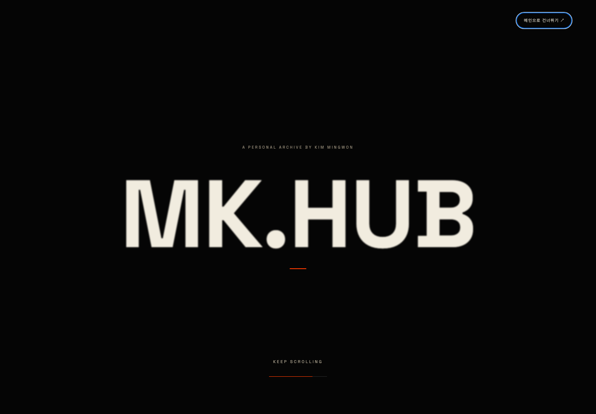
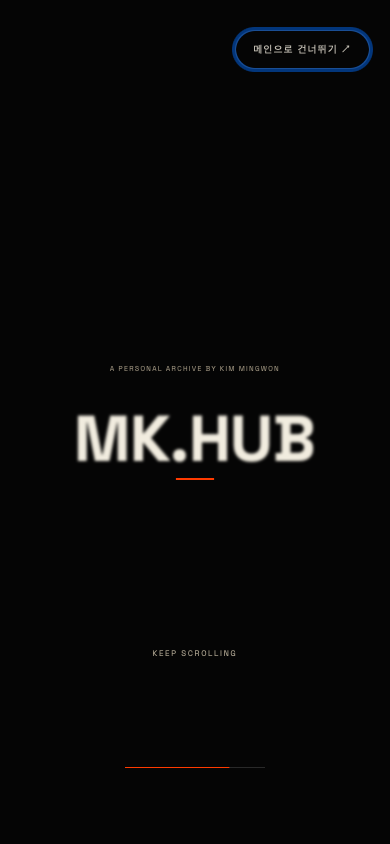
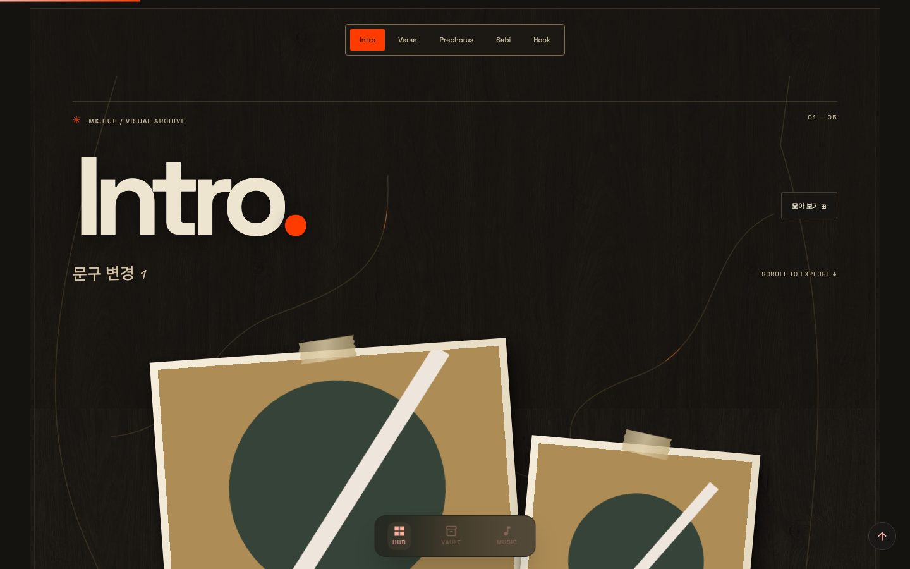
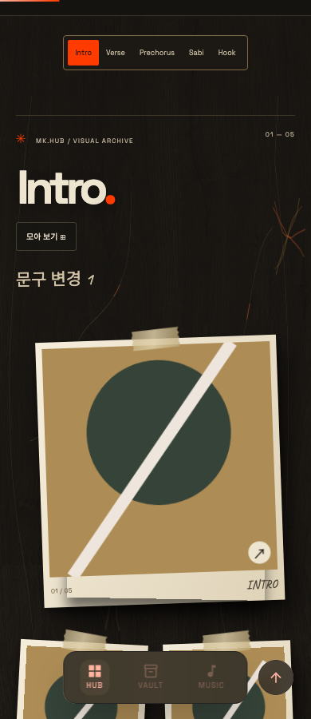
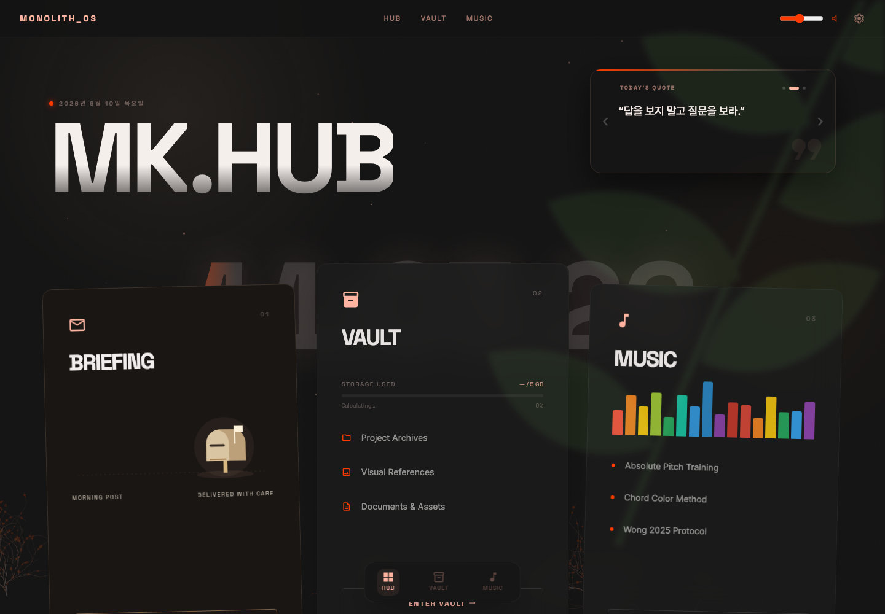

# MK.HUB — 검정·주황 / 우드 아카이브 1차 시안

로컬 미리보기: http://127.0.0.1:8766/ (로컬 서버 실행 중)
브랜치: `design/woodland-interactive`. 사용자 제공 작업 원칙의 “디자인 수정: 1차 안까지만 만들고 사용자 검토 게이트” 적용. 운영 main 병합·배포는 검토 후 진행.

## 진입 연출

스크롤 0–65%: 검정 최상위 화면에서 흰 비둘기 비행 → 신문 투입.
65–88%: 중앙 MK.HUB 대형 타이틀, 자간·초점·위치 변화.
88–100%: 우체통 위치를 중심으로 검정 화면이 열리며 메인 Brief 카드로 연결.
휠·터치·키보드로 진행/되감기. 입력 후 짧은 감속을 제외하면 정지. 완료 후 해당 페이지에서 재생 반복 없음. 새로고침 시 다시 입장. 건너뛰기·Escape 지원. 모션 감소 설정은 바로 메인 표시.

## 메인·갤러리

검정과 기존 주황 `#FF3B00` 유지. 메인 글자 분산, 카드 펼침, 배경 시차, 요일 순차 등장, 완료 입자, 자석 버튼 추가.
메인 진입 8초 후 반투명 초록 잎 그림자 첫 등장. 이후 35초 주기로 12초간 이동, 최대 불투명도 14%. 클릭 통과, 다른 페이지·숨겨진 탭·모션 감소 설정에서는 중단.
5개 챕터를 월넛 벽면·앰버 수액·종이 테두리·찢긴 테이프로 연결. 포인터 주변 가지 성장, 사진 기울기, 모아 보기 전환, 부모 전체화면 확대 지원.
사진의 원색은 유지. 아래 사진과 문구는 격리된 테스트용 데이터이며 실제 사용자 자료 아님.

## 저장 호환

| 대상 | 유지 사항 |
| --- | --- |
| 사진 | IndexedDB `mkhub_pics` / `pics`, 기존 p1~p5 키 109개 유지 |
| 1·2번 문구 | `editorial_layout_state_v1.texts`, `lowtheory_editable_state_v10.text`, 기존 필드 유지 |
| 3~5번 문구 | 기존 41개 문구 보존, 새 로컬 저장 연결 |
| 전체 문구 | 59개 편집 가능, 빈 문구와 다른 저장 필드 보존 |
| 할 일 | Firestore `mk_app/data/todos`, 기존 text/date/done/c 유지 |
| Brief | 기존 briefs·읽음 상태·기사 수신 경로 유지; 입장 연출은 수신 여부와 독립 |
| 사진 삭제 | 삭제 표시 키 추가로 레거시 사진 재등장 방지, 원본 슬롯 삭제 |

운영 DB에 테스트 쓰기 없음. localhost는 민권.com과 저장소 출처가 달라 운영 사진이 자동으로 나타나지 않음. 테스트는 임시 브라우저 저장소에서 기존 키의 복원·수정·삭제를 검증.

## 검증 결과

- Chromium: 109칸 복원·사진 삭제/재등록·새로고침·인접 슬롯 유지, 59문구·빈 문구·기타 필드 보존 통과.
- Weekly Todo: 격리된 쓰기 대역으로 완료·추가·날짜·진행률 확인. 잠금 해제/재잠금, 부모/독립 확대와 키보드 확인.
- 390/768/1440px: 가로 넘침·iframe 높이 잘림 없음.
- Chromium/WebKit: 스크롤 정지·역방향·타이틀·메인 공개·완료 후 미재생 통과, 인트로 검사 중 pageerror 없음.
- WebKit: 터치 입장, 모션 감소 우회, 390/800px 요일 영역 너비 통과.
- JS 구문·공백 검사 통과. 실기기 성능과 실제 사용자 사진 구성은 사용자 시안 검토 대상.

## 레퍼런스 적용

- [Lusion](https://lusion.co/): 스크롤로 장면을 진행하고 다음 공간을 드러내는 방식.
- [Cosmos](https://www.cosmos.so/): 개인 이미지 수집과 탐색 흐름. 최초 cosmos.co 요청은 앞서 안내한 cosmos.so 기준 해석.
- [Daylight](https://daylightcomputer.com/): 따뜻한 표면·종이 질감·큰 여백.
- [Lowtheory](https://www.behance.net/gallery/244657505/lowtheory-Creative-agency-UIUX-Brand-design): 큰 타이포와 비대칭 아날로그 콜라주. 원본 디자인 자산 복제 없음.

## 생성 자산

`assets/archive-walnut.png` — 내장 image generation 도구로 생성한 신규 비트맵. 비둘기·수액·테이프는 SVG/CSS.
생성 방향: 정면에서 본 어두운 walnut/smoked oak 벽면, charcoal/tobacco 갈색, 은은한 결, 무광, 반복 가능한 질감. 물체·문자·핑크·주황 선 제외.
